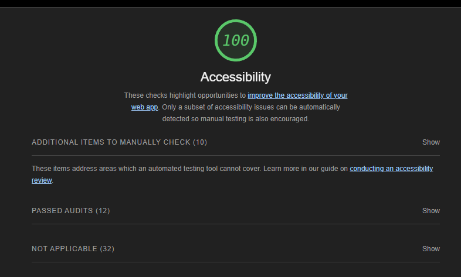

# LAB-02: About Me Project

## Project Name

This is an *about me* website that asks the user for their name and 5 Yes or No questions to hopefully give them some information on who i am and where i am from. 

### Author: Donna M. Ada, Navigator

Driver: Ike Steoger, lab04.js

### Links and Resources

* [A Modern CSS Reset](https://andy-bell.co.uk/a-modern-css-reset/) - Went through some of the styles to get an idea of how to set up classes after using a reset.css

### Lighthouse Accessibility Report Score

* Provide a screenshot of your score after running a Lighthouse Accessibility report.

### Reflections and Comments

* I completely forgot about the 15 minute rule and spent way longer than I should have trying to set up a default.css that sets up the styles for some key html tags like 
    * `h1`-`h6`
    * `p`
    * `ol`
    * `li`
    * `strong` & `em`

#### Tools to look into for future projects
* [Browser Default Styles](https://browserdefaultstyles.com/)  
    * I did not find this until after creating the default.css. Will look into this and add it to the starter template